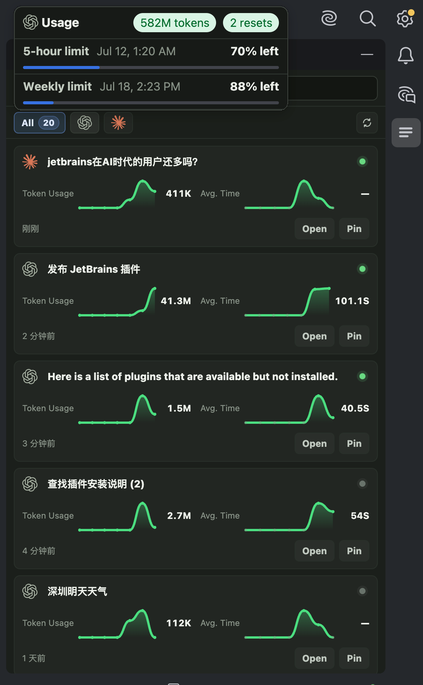
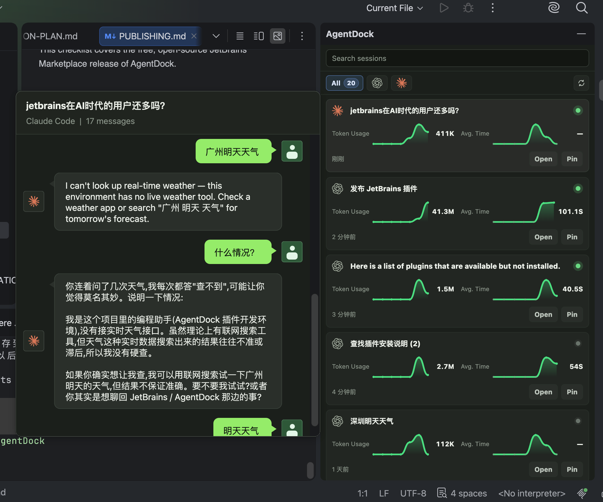

# AgentDock

[English](#readme-english) | [简体中文](#readme-chinese)

<a id="readme-english"></a>

## English

> Put every AI session in its place.

AgentDock is a local-first, project-scoped AI CLI session dashboard for JetBrains IDEs. It discovers Codex CLI, Claude Code, and Gemini CLI sessions associated with the current project and brings them into a full-height panel on the right side of the IDE, where developers can inspect, resume, pin, filter, and monitor ongoing work.

AgentDock does not replace the JetBrains Terminal tool window or keep CLI processes alive. It reads provider-owned local session files, stores lightweight project metadata, and opens the appropriate resume command in a JetBrains Terminal tab when requested.


### Features

- A resizable, full-height `AgentDock` panel integrated into the right side of the IDE
- Automatic project-scoped discovery for Codex CLI, Claude Code, and Gemini CLI sessions
- Search, provider filters, session count, manual refresh, and periodic background refresh
- Session cards with 7-day Token Usage and Avg. Time trends, historical token totals, and today's average response time
- Chat-style conversation previews when hovering a session title
- Provider usage popups with project token totals, 5-hour and weekly limits, reset times, and reset credits when available
- `Open`, provider-specific `YOLO`, and `Pin / Unpin` actions on every session card
- Gray/green card indicators showing whether an AgentDock-launched CLI terminal is inactive or active
- Terminal title states for idle, working, and ready-for-review sessions
- Live model output in a title-anchored, right-to-left scrolling bubble while the model is working
- Configurable provider executables and detection, start, resume, and YOLO command templates
- Local persistence of project-scoped metadata and calculated session metrics
- Clipboard fallback when the JetBrains Terminal API cannot send a command

### Session Cards and Terminal States

Each card is a compact view of one local provider session:

| Card element | Meaning or action |
| --- | --- |
| Gray terminal dot | No AgentDock-launched CLI terminal is currently active for the session |
| Pulsing green terminal dot | At least one AgentDock-launched CLI terminal is active for the session |
| Token Usage | Historical total plus a trend for each of the last 7 days |
| Avg. Time | Daily average response-time trend for the last 7 days plus today's value in seconds |
| Session title hover | Opens a local chat-style conversation preview, with AI messages on the left and user messages on the right |
| Open | Resumes the session with the provider's normal permission behavior |
| YOLO | Resumes with the provider-specific permission-bypass option |
| Pin / Unpin | Moves important sessions to or from the pinned group |

Terminal tabs opened by AgentDock use the provider logo to communicate work state without adding another status icon:

| State | Terminal title behavior |
| --- | --- |
| Idle | Provider logo remains static |
| Working | Provider logo repeatedly scales up and down; filtered model output scrolls above the title in a pointer bubble |
| Ready for review | A green badge appears on the provider logo and the scrolling bubble is removed |
| Viewed | Focusing the completed Terminal tab clears `Ready for review` back to Idle |

The activity state and streaming bubble apply to Terminal tabs opened from AgentDock. Closing the tab or exiting the CLI clears that terminal instance; the card returns to gray when no AgentDock-launched instance remains.

### Usage Insights

Hovering a provider logo in the filter bar opens a compact popup above the filter. It shows the current project's token total for that provider and, where supported by the local account, 5-hour and weekly plan limits with reset times and remaining reset credits. Codex usage is queried through the locally installed Codex app server; Claude Code usage uses locally available subscription credentials. Gemini CLI currently reports project session metrics but not provider plan limits.

<p align="center">
  
</p>

Hovering a session title opens a local conversation preview to the left of the card. The preview reads the provider's existing history file and does not create a second transcript store.

<p align="center">
  
</p>

### Support Matrix

| Item | Current support |
| --- | --- |
| Plugin platform | IntelliJ Platform / JetBrains IDEs |
| Target IDEs | PyCharm, IntelliJ IDEA, WebStorm, PhpStorm, and others |
| IntelliJ `since-build` | `252` |
| Built-in providers | Codex, Claude Code, Gemini CLI |
| Dashboard UI | JCEF-based panel, with a simplified Swing fallback when JCEF is unavailable |
| Storage | IntelliJ `PersistentStateComponent` |
| Terminal integration | JetBrains Terminal tabs, provider icons, activity states, and streaming output overlay |
| Provider plan usage | Codex and Claude Code when supported by the local account; Gemini CLI is not yet supported |

### Project Structure

```text
.
├── agentdock-plugin/
│   ├── build.gradle.kts
│   └── src/
│       ├── main/
│       │   ├── kotlin/com/agentdock/
│       │   │   ├── actions/        # Tools menu and session actions
│       │   │   ├── model/          # Models such as AgentSession and CLIProvider
│       │   │   ├── notification/   # IDE notification wrappers
│       │   │   ├── service/        # Discovery, previews, metrics, usage limits, and session services
│       │   │   ├── storage/        # Persistent state, filtering, and migrations
│       │   │   ├── terminal/       # Terminal launch, task states, output monitoring, and fallbacks
│       │   │   ├── ui/             # Dashboard, persistent layout, popups, settings, and dialogs
│       │   │   └── util/
│       │   ├── java/com/agentdock/ui/
│       │   └── resources/
│       │       ├── META-INF/plugin.xml
│       │       └── icons/
│       └── test/kotlin/com/agentdock/
├── docs/
│   ├── images/
│   │   └── AgentDock*.png
│   ├── AgentDock-PRD.md
│   ├── AgentDock-IMPLEMENTATION-PLAN.md
│   ├── TECH-STACK.md
│   └── agentdock-prototype.html
├── build.gradle.kts
├── gradle.properties
├── settings.gradle.kts
└── gradlew
```

### Default Provider Configuration

| Provider | Executable | Detection command | Start command | Resume command | YOLO resume command |
| --- | --- | --- | --- | --- | --- |
| Codex | `codex` | `codex --version` | `{{executable}}` | `{{executable}} resume {{providerSessionId?}}` | `{{executable}} resume --dangerously-bypass-approvals-and-sandbox {{providerSessionId?}}` |
| Claude Code | `claude` | `claude --version` | `{{executable}} --ide --name {{sessionName}}` | `{{executable}} --resume {{providerSessionId?}} --ide` | `{{executable}} --resume {{providerSessionId?}} --ide --dangerously-skip-permissions` |
| Gemini CLI | `gemini` | `gemini --version` | `{{executable}}` | `{{executable}} --resume {{providerSessionId?}}` | `{{executable}} --resume {{providerSessionId?}} --yolo` |

Command templates support the following variables:

- `{{executable}}`
- `{{providerSessionId}}` / `{{providerSessionId?}}`
- `{{sessionName}}`
- `{{cwd}}`
- `{{projectPath}}`

Variables with a `?` suffix are optional and are removed when their values are empty. Provider settings can be changed under `Tools > AgentDock Settings` in the IDE.

The `YOLO` card action bypasses the selected CLI's normal permission checks and sandbox restrictions. Use it only in workspaces you trust.

### Requirements

- JetBrains IDE `2025.2+`, corresponding to IntelliJ build `252+`
- JDK 21 is recommended for local Gradle and IntelliJ Platform builds
- The Gradle wrapper is included; a separate Gradle installation is not required
- A local `codex` executable is required to use Codex
- A local `claude` executable is required to use Claude Code
- A local `gemini` executable is required to use Gemini CLI

If the default Java version on your machine is older, set `JAVA_HOME` explicitly:

```bash
JAVA_HOME=/opt/homebrew/opt/openjdk@21 ./gradlew :agentdock-plugin:test
```

### Local Development

Launch a development IDE:

```bash
./gradlew :agentdock-plugin:runIde
```

Run tests:

```bash
./gradlew :agentdock-plugin:test
```

Verify the plugin project configuration:

```bash
./gradlew :agentdock-plugin:verifyPluginProjectConfiguration
```

Verify the plugin structure:

```bash
./gradlew :agentdock-plugin:verifyPluginStructure
```

Run Plugin Verifier:

```bash
./gradlew :agentdock-plugin:verifyPlugin
```

Build the plugin package:

```bash
./gradlew :agentdock-plugin:buildPlugin
```

Build artifacts are written to:

```text
agentdock-plugin/build/distributions/
```

### Install the Plugin Package

We recommend downloading a prebuilt plugin ZIP from GitHub Releases:

1. Open [AgentDock Releases](https://github.com/xmanrui/AgentDock/releases/latest).
2. Download `agentdock-plugin-*.zip` from the release assets.
3. In your JetBrains IDE, go to `Settings / Preferences > Plugins`, click the gear icon, and select `Install Plugin from Disk...`.

4. Select the downloaded ZIP file.
5. Restart the IDE.

Developers can also build the plugin package locally from source:

```bash
./gradlew :agentdock-plugin:buildPlugin
```

After the build completes, go to `Settings / Preferences > Plugins` in your JetBrains IDE, click the gear icon, and select `Install Plugin from Disk...`. Select the generated ZIP file under `agentdock-plugin/build/distributions/`, then restart the IDE.

After installation, AgentDock can be opened from:

- `AgentDock` on the right-side Tool Window bar
- `Tools > Open AgentDock`
- `Tools > AgentDock Settings`

### Usage

#### Discover and Filter Sessions

1. Open any project in a JetBrains IDE.
2. Open the `AgentDock` panel on the right.
3. AgentDock discovers provider sessions whose working directories belong to the current project.
4. Use the search field or provider logos to narrow the list.
5. Use the refresh button when you want to rescan immediately; the visible panel also refreshes periodically in the background.

#### Open or Resume a Session

1. Click `Open` to resume with the provider's normal permission behavior, or `YOLO` to use its configured permission-bypass command.
2. AgentDock renders the command from the provider settings, working directory, and provider session ID.
3. The plugin creates a named Terminal tab, applies the provider logo, and sends the command.
4. If the Terminal API call fails, AgentDock opens the Terminal tool window and copies the command to the clipboard.

#### Inspect and Monitor Work

- Hover a session title to inspect its recent local conversation.
- Hover a provider filter logo to inspect project tokens and available plan limits.
- Read Token Usage and Avg. Time trends directly from each session card.
- Use `Pin / Unpin` to keep important sessions at the top.
- Watch the provider logo and scrolling bubble in the Terminal title area to distinguish working, completed, and viewed tasks.

The session-card terminal dot tracks whether an AgentDock-launched CLI terminal remains active; it is not a model work indicator. Model activity is shown separately on the Terminal tab's provider logo.

### Local Session Discovery

AgentDock discovers existing local sessions based on the current project path:

- Codex: reads `~/.codex/sessions` and `~/.codex/session_index.jsonl`
- Claude Code: reads `~/.claude/projects`
- Gemini CLI: reads project-scoped sessions from `~/.gemini/tmp/<project_hash>/chats`

Only sessions whose working directories are inside the current JetBrains project are imported, avoiding mixing session histories across projects.

### Data and Privacy

- AgentDock reads local Codex, Claude Code, and Gemini CLI session files for discovery, conversation previews, Token Usage, Avg. Time, and terminal lifecycle events.
- It stores lightweight session metadata and calculated metric caches locally but does not persist a separate copy of complete transcripts or Terminal output.
- Live Terminal text is read transiently, filtered for the scrolling bubble, and discarded when the task completes or the tab closes.
- The Claude usage feature may read locally available OAuth credentials and uses them only to request plan usage from the configured endpoint.
- The Codex usage feature starts the locally installed `codex app-server --stdio` process to request rate-limit information and does not directly read a Codex API key.
- AgentDock does not operate a cloud service and does not collect analytics or telemetry.
- Provider settings are stored at the application level.
- Project session metadata and metric caches are stored in the project's workspace state.

See the [AgentDock Privacy Policy](PRIVACY.md) for complete details.

### Known Limitations

- AgentDock currently includes built-in support for Codex, Claude Code, and Gemini CLI.
- OpenCode, Junie, and other providers are not built in yet.
- Provider plan-limit popups are currently implemented for Codex and Claude Code; Gemini CLI shows local session metrics but no plan limits.
- Terminal work states and the streaming bubble are tracked only for tabs opened through AgentDock and depend on lifecycle data written by the provider CLI.
- CLI processes are not guaranteed to remain alive after the IDE is closed.
- The current dashboard exposes `Open`, `YOLO`, and `Pin / Unpin`; create, rename, and archive controls are not exposed in the session cards.
- A simplified Swing placeholder is shown when JCEF is unavailable.

### License

This project is released under the MIT License. See `LICENSE` for details.

AgentDock is an independent open-source project and is not affiliated with, endorsed by, or sponsored by Google, OpenAI, Anthropic, or JetBrains. Gemini, Codex, Claude, Claude Code, JetBrains, and related marks belong to their respective owners.

### Reference Documents

- `docs/AgentDock-PRD.md`
- `docs/AgentDock-IMPLEMENTATION-PLAN.md`
- `docs/TECH-STACK.md`
- `docs/PUBLISHING.md`
- `docs/agentdock-prototype.html`

---

<a id="readme-chinese"></a>

## 简体中文

> 让AI会话，各就各位。

AgentDock 是一个本地优先、面向 JetBrains IDE 的项目级 AI CLI 会话面板。它自动发现当前项目关联的 Codex CLI、Claude Code 和 Gemini CLI 会话，并集中展示在 IDE 右侧的全高面板中，方便开发者查看、恢复、置顶、筛选和监控 AI 工作。

AgentDock 不替代 JetBrains Terminal，也不负责保活 CLI 进程。它读取各 Provider 自己保存的本地会话文件，仅持久化轻量的项目元数据，并在需要时通过 JetBrains Terminal 执行对应的恢复命令。

### 功能概览

- 集成在 IDE 右侧、可调整宽度并始终占满纵向空间的 `AgentDock` 面板
- 自动发现当前项目关联的 Codex CLI、Claude Code 和 Gemini CLI 会话
- 搜索、Provider 筛选、会话数量、手动刷新和定时后台刷新
- 会话卡片展示最近 7 天 Token Usage 与 Avg. Time 趋势、历史 Token 总量和当天平均响应时间
- 鼠标悬停会话标题时，以聊天气泡样式预览本地会话内容
- 鼠标悬停 Provider 筛选 Logo 时，显示项目 Token 总量、5 小时额度、周额度、重置时间和可用重置次数
- 每张会话卡片提供 `Open`、Provider 专属 `YOLO` 和 `Pin / Unpin`
- 卡片灰点/绿点表示 AgentDock 启动的对应 CLI 终端是否处于非活动/活动状态
- 终端标题区分空闲、工作中和等待查收三种状态
- 大模型工作时，在终端标题上方的指向式消息框中从右向左滚动展示经过过滤的流式输出
- Provider executable、detect/start/resume/YOLO command template 可配置
- 项目级会话元数据与计算后的指标缓存保存在本地
- Terminal API 异常时复制命令到剪贴板作为 fallback

### 会话卡片与终端状态

每张卡片对应一个本地 Provider 会话：

| 卡片元素 | 含义或操作 |
| --- | --- |
| 灰色终端点 | 当前没有与该会话关联、由 AgentDock 启动且仍活动的 CLI 终端 |
| 闪烁绿色终端点 | 该会话至少有一个由 AgentDock 启动的 CLI 终端仍处于活动状态 |
| Token Usage | 历史 Token 总量与最近 7 天逐日趋势 |
| Avg. Time | 最近 7 天每日平均响应时间趋势，以及当天以秒为单位的平均值 |
| 悬停会话标题 | 打开本地聊天式预览，AI 消息在左，用户消息在右 |
| Open | 按 Provider 的常规权限行为恢复会话 |
| YOLO | 使用该 Provider 专属的跳过权限确认参数恢复会话 |
| Pin / Unpin | 将重要会话置顶或取消置顶 |

AgentDock 打开的 Terminal Tab 使用 Provider Logo 本身表达工作状态，不额外叠加第二个状态图标：

| 状态 | 终端标题表现 |
| --- | --- |
| Idle（空闲） | Provider Logo 保持静止 |
| Working（工作中） | Provider Logo 循环放大缩小；标题上方显示从右向左滚动的流式消息框 |
| Ready for review（等待查收） | Provider Logo 出现绿色角标，同时移除滚动消息框 |
| Viewed（已查看） | 聚焦已完成的 Terminal Tab 后，状态从等待查收恢复为空闲 |

终端工作状态和流式消息框只作用于从 AgentDock 打开的 Terminal Tab。关闭 Tab 或通过 `/exit` 退出 CLI 都会结束对应终端实例；没有其它活动实例时，卡片绿点会恢复为灰色。

### 用量信息

鼠标悬停筛选栏的 Provider Logo 时，紧凑信息框会在筛选栏上方显示该 Provider 在当前项目中的 Token 总量；本地账号支持时，还会显示 5 小时额度、周额度、重置时间和剩余重置次数。Codex 通过本机 Codex app server 查询额度，Claude Code 使用本机可用的订阅凭据；Gemini CLI 当前可以计算本地会话指标，但尚不支持 Provider 套餐额度。

鼠标悬停会话标题时，信息框会读取 Provider 已有的本地历史文件，在卡片左侧展示聊天式会话预览，不会额外保存一份完整聊天记录。

### 支持范围

| 项目 | 当前状态 |
| --- | --- |
| 插件平台 | IntelliJ Platform / JetBrains IDE |
| 目标 IDE | PyCharm, IntelliJ IDEA, WebStorm, PhpStorm 等 |
| since build | `252` |
| 内置 provider | Codex, Claude Code, Gemini CLI |
| Dashboard UI | JCEF 面板，JCEF 不可用时使用简化 Swing fallback |
| 存储 | IntelliJ `PersistentStateComponent` |
| 终端集成 | JetBrains Terminal Tab、Provider Logo、任务状态和流式输出浮层 |
| Provider 套餐额度 | 本地账号支持时提供 Codex 和 Claude Code；Gemini CLI 暂不支持 |

### 项目结构

```text
.
├── agentdock-plugin/
│   ├── build.gradle.kts
│   └── src/
│       ├── main/
│       │   ├── kotlin/com/agentdock/
│       │   │   ├── actions/        # Tools 菜单和会话动作
│       │   │   ├── model/          # AgentSession, CLIProvider 等模型
│       │   │   ├── notification/   # IDE 通知封装
│       │   │   ├── service/        # 发现、预览、指标、套餐额度和会话服务
│       │   │   ├── storage/        # 持久化状态、过滤和迁移
│       │   │   ├── terminal/       # Terminal 启动、任务状态、输出监控和 fallback
│       │   │   ├── ui/             # Dashboard、持久布局、弹窗和设置页
│       │   │   └── util/
│       │   ├── java/com/agentdock/ui/
│       │   └── resources/
│       │       ├── META-INF/plugin.xml
│       │       └── icons/
│       └── test/kotlin/com/agentdock/
├── docs/
│   ├── images/
│   │   └── AgentDock*.png
│   ├── AgentDock-PRD.md
│   ├── AgentDock-IMPLEMENTATION-PLAN.md
│   ├── TECH-STACK.md
│   └── agentdock-prototype.html
├── build.gradle.kts
├── gradle.properties
├── settings.gradle.kts
└── gradlew
```

### Provider 默认配置

| Provider | Executable | Detect command | Start command | Resume command | YOLO resume command |
| --- | --- | --- | --- | --- | --- |
| Codex | `codex` | `codex --version` | `{{executable}}` | `{{executable}} resume {{providerSessionId?}}` | `{{executable}} resume --dangerously-bypass-approvals-and-sandbox {{providerSessionId?}}` |
| Claude Code | `claude` | `claude --version` | `{{executable}} --ide --name {{sessionName}}` | `{{executable}} --resume {{providerSessionId?}} --ide` | `{{executable}} --resume {{providerSessionId?}} --ide --dangerously-skip-permissions` |
| Gemini CLI | `gemini` | `gemini --version` | `{{executable}}` | `{{executable}} --resume {{providerSessionId?}}` | `{{executable}} --resume {{providerSessionId?}} --yolo` |

命令模板支持的变量包括:

- `{{executable}}`
- `{{providerSessionId}}` / `{{providerSessionId?}}`
- `{{sessionName}}`
- `{{cwd}}`
- `{{projectPath}}`

带 `?` 的变量是可选变量，值为空时会被移除。Provider 设置可以在 IDE 的 `Tools > AgentDock Settings` 中修改。

会话卡片上的 `YOLO` 操作会跳过对应 CLI 的常规权限确认和沙箱限制，请仅在可信工作区中使用。

### 环境要求

- JetBrains IDE `2025.2+`，对应 IntelliJ build `252+`
- JDK 21 推荐用于本地 Gradle/IntelliJ Platform 构建任务
- Gradle wrapper 已包含，无需单独安装 Gradle
- 使用 Codex 功能时需要本机可执行 `codex`
- 使用 Claude Code 功能时需要本机可执行 `claude`
- 使用 Gemini CLI 功能时需要本机可执行 `gemini`

如果本机默认 Java 版本较低，可以显式指定:

```bash
JAVA_HOME=/opt/homebrew/opt/openjdk@21 ./gradlew :agentdock-plugin:test
```

### 本地开发

运行开发 IDE:

```bash
./gradlew :agentdock-plugin:runIde
```

运行测试:

```bash
./gradlew :agentdock-plugin:test
```

验证插件项目配置:

```bash
./gradlew :agentdock-plugin:verifyPluginProjectConfiguration
```

验证插件结构:

```bash
./gradlew :agentdock-plugin:verifyPluginStructure
```

运行 Plugin Verifier:

```bash
./gradlew :agentdock-plugin:verifyPlugin
```

构建插件包:

```bash
./gradlew :agentdock-plugin:buildPlugin
```

构建产物位于:

```text
agentdock-plugin/build/distributions/
```

### 安装插件包

推荐从 GitHub Releases 下载已构建好的插件 zip:

1. 打开 [AgentDock Releases](https://github.com/xmanrui/AgentDock/releases/latest)。
2. 下载 release assets 中的 `agentdock-plugin-*.zip`。
3. 在 JetBrains IDE 中打开:

```text
Settings / Preferences > Plugins > 齿轮菜单 > Install Plugin from Disk...
```

4. 选择下载的 zip 文件。
5. 重启 IDE。

开发者也可以从源码本地构建插件包:

```bash
./gradlew :agentdock-plugin:buildPlugin
```

构建完成后，在 JetBrains IDE 中打开:

```text
Settings / Preferences > Plugins > 齿轮菜单 > Install Plugin from Disk...
```

选择 `agentdock-plugin/build/distributions/` 下生成的 zip 文件，然后重启 IDE。

安装后可以通过以下入口打开:

- 右侧 Tool Window Bar 的 `AgentDock`
- `Tools > Open AgentDock`
- `Tools > AgentDock Settings`

### 使用方式

#### 发现与筛选会话

1. 打开任意 JetBrains 项目。
2. 打开右侧 `AgentDock` 面板。
3. AgentDock 会自动发现工作目录属于当前项目的 Provider 会话。
4. 使用搜索框或 Provider Logo 缩小会话范围。
5. 需要立即重新扫描时点击刷新按钮；面板可见期间也会定时在后台刷新。

#### 打开或恢复会话

1. 点击 `Open` 按 Provider 的常规权限行为恢复，或点击 `YOLO` 使用已配置的跳过权限确认命令。
2. AgentDock 根据 Provider 设置、工作目录和 Provider Session ID 渲染命令。
3. 插件创建带名称和 Provider Logo 的 Terminal Tab，并发送命令。
4. 如果 Terminal API 调用失败，AgentDock 会打开 Terminal 并把命令复制到剪贴板。

#### 查看与监控工作

- 悬停会话标题，查看最近的本地会话内容。
- 悬停 Provider 筛选 Logo，查看项目 Token 和可用套餐额度。
- 直接从卡片读取 Token Usage 与 Avg. Time 趋势。
- 使用 `Pin / Unpin` 将重要会话保持在列表前方。
- 通过 Terminal 标题区的 Provider Logo 与滚动消息框区分工作中、已完成和已查看任务。

会话卡片上的终端点只表示 AgentDock 启动的 CLI 终端是否仍然活动，不表示大模型是否正在工作。模型工作状态由 Terminal Tab 上的 Provider Logo 单独展示。

### 本地会话发现

AgentDock 会根据当前项目路径发现本机已有会话:

- Codex: 读取 `~/.codex/sessions` 和 `~/.codex/session_index.jsonl`
- Claude Code: 读取 `~/.claude/projects`
- Gemini CLI: 读取 `~/.gemini/tmp/<project_hash>/chats` 下与当前项目关联的会话

只会导入工作目录属于当前 JetBrains 项目的会话，避免跨项目历史混杂。

### 数据与隐私

- AgentDock 会读取本地 Codex、Claude Code 和 Gemini CLI 会话文件，用于项目发现、会话预览、Token Usage、Avg. Time 和终端生命周期识别。
- 插件只在本地保存轻量会话元数据和计算后的指标缓存，不额外持久化完整会话内容或终端输出。
- 实时终端文本只会被临时读取并过滤后显示在滚动消息框中，任务完成或 Tab 关闭后即丢弃。
- Claude 用量功能可能读取本机可用的 OAuth 凭据，并仅用于向配置的端点查询套餐用量。
- Codex 用量功能会启动本机 `codex app-server --stdio` 查询额度信息，不直接读取 Codex API key。
- AgentDock 不运营云服务，也不收集 analytics 或 telemetry。
- Provider 设置是 application-level 状态。
- 项目会话元数据和指标缓存保存在项目 workspace 状态中。

完整说明请参阅 [AgentDock 隐私政策](PRIVACY.md)。

### 已知限制

- 当前内置 Codex、Claude Code 和 Gemini CLI。
- OpenCode、Junie 等 Provider 尚未内置。
- Provider 套餐额度目前支持 Codex 和 Claude Code；Gemini CLI 仅显示本地会话指标，不显示套餐额度。
- 终端工作状态和流式消息框只跟踪通过 AgentDock 打开的 Tab，并依赖 Provider CLI 写入的生命周期数据。
- 不保证 IDE 关闭后 CLI 进程仍然存活。
- 当前会话卡片提供 `Open`、`YOLO` 和 `Pin / Unpin`；新建、重命名和归档控件未在当前 Dashboard 中开放。
- JCEF 不可用时会显示简化的 Swing 占位界面。

### 开源协议

本项目基于 MIT License 开源，详见 `LICENSE`。

AgentDock 是独立开源项目，与 Google、OpenAI、Anthropic 或 JetBrains 不存在附属、认可或赞助关系。Gemini、Codex、Claude、Claude Code、JetBrains 及相关商标归各自权利人所有。

### 参考文档

- `docs/AgentDock-PRD.md`
- `docs/AgentDock-IMPLEMENTATION-PLAN.md`
- `docs/TECH-STACK.md`
- `docs/PUBLISHING.md`
- `docs/agentdock-prototype.html`
