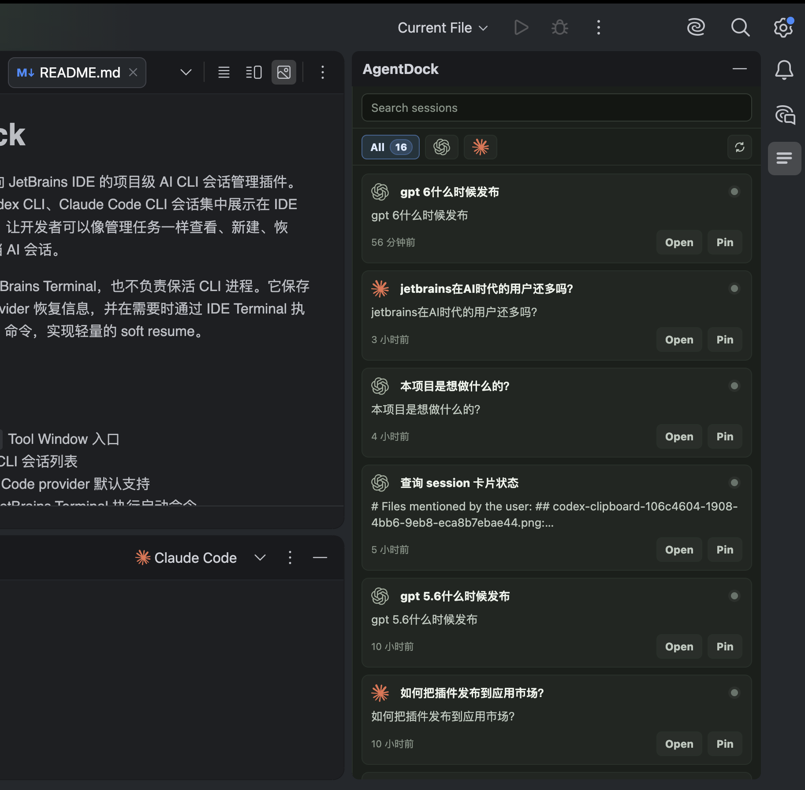

# AgentDock

[English](#readme-english) | [简体中文](#readme-chinese)

<a id="readme-english"></a>

## English

AgentDock is a project-scoped AI CLI session management plugin for JetBrains IDEs. It brings together Codex CLI, Claude Code CLI, and Gemini CLI sessions associated with the current project in the `AgentDock` Tool Window on the right side of the IDE, allowing developers to view, create, resume, search, pin, and archive AI sessions much like managing tasks.

AgentDock does not replace the JetBrains Terminal tool window or keep CLI processes alive. It stores session metadata and provider-specific resume information, then runs the appropriate start or resume command in the Terminal tool window when needed, providing a lightweight form of soft resume.



### Features

- An `AgentDock` Tool Window on the right side of the IDE
- AI CLI sessions scoped to the current project
- Built-in support for Codex, Claude Code, and Gemini CLI providers
- Create sessions and run their start commands in the Terminal tool window
- Resume existing sessions with provider-specific resume commands
- Automatically discover local Codex, Claude Code, and Gemini CLI sessions associated with the current project
- Search sessions; filter by provider or status; rename, pin, and archive sessions
- Configurable provider executables and detection, start, and resume command templates
- Local persistence of project-scoped session metadata
- Copy the command to the clipboard as a fallback when the Terminal API fails

### Support Matrix

| Item | Current support |
| --- | --- |
| Plugin platform | IntelliJ Platform / JetBrains IDEs |
| Target IDEs | PyCharm, IntelliJ IDEA, WebStorm, PhpStorm, and others |
| IntelliJ `since-build` | `252` |
| Built-in providers | Codex, Claude Code, Gemini CLI |
| UI | JCEF-based Tool Window UI, with a Swing fallback when JCEF is unavailable |
| Storage | IntelliJ `PersistentStateComponent` |
| Terminal integration | JetBrains Terminal plugin |

### Project Structure

```text
.
├── agentdock-plugin/
│   ├── build.gradle.kts
│   └── src/
│       ├── main/
│       │   ├── kotlin/com/agentdock/
│       │   │   ├── actions/        # Tools menu and session actions
│       │   │   ├── model/          # Models such as AgentSession and CLIProvider
│       │   │   ├── notification/   # IDE notification wrappers
│       │   │   ├── service/        # Session services, provider detection, and local discovery
│       │   │   ├── storage/        # Persistent state, filtering, and migrations
│       │   │   ├── terminal/       # Terminal launch, command rendering, and fallbacks
│       │   │   ├── ui/             # Tool Window, HTML renderer, settings page, and dialogs
│       │   │   └── util/
│       │   ├── java/com/agentdock/ui/
│       │   └── resources/
│       │       ├── META-INF/plugin.xml
│       │       └── icons/
│       └── test/kotlin/com/agentdock/
├── docs/
│   ├── images/
│   │   └── AgentDock.png
│   ├── AgentDock-PRD.md
│   ├── AgentDock-IMPLEMENTATION-PLAN.md
│   ├── TECH-STACK.md
│   └── agentdock-prototype.html
├── build.gradle.kts
├── gradle.properties
├── settings.gradle.kts
└── gradlew
```

### Default Provider Configuration

| Provider | Executable | Detection command | Start command | Resume command | YOLO resume command |
| --- | --- | --- | --- | --- | --- |
| Codex | `codex` | `codex --version` | `{{executable}}` | `{{executable}} resume {{providerSessionId?}}` | `{{executable}} resume --dangerously-bypass-approvals-and-sandbox {{providerSessionId?}}` |
| Claude Code | `claude` | `claude --version` | `{{executable}} --ide --name {{sessionName}}` | `{{executable}} --resume {{providerSessionId?}} --ide` | `{{executable}} --resume {{providerSessionId?}} --ide --dangerously-skip-permissions` |
| Gemini CLI | `gemini` | `gemini --version` | `{{executable}}` | `{{executable}} --resume {{providerSessionId?}}` | `{{executable}} --resume {{providerSessionId?}} --yolo` |

Command templates support the following variables:

- `{{executable}}`
- `{{providerSessionId}}` / `{{providerSessionId?}}`
- `{{sessionName}}`
- `{{cwd}}`
- `{{projectPath}}`

Variables with a `?` suffix are optional and are removed when their values are empty. Provider settings can be changed under `Tools > AgentDock Settings` in the IDE.

The `YOLO` card action bypasses the selected CLI's normal permission checks and sandbox restrictions. Use it only in workspaces you trust.

### Requirements

- JetBrains IDE `2025.2+`, corresponding to IntelliJ build `252+`
- JDK 21 is recommended for local Gradle and IntelliJ Platform builds
- The Gradle wrapper is included; a separate Gradle installation is not required
- A local `codex` executable is required to use Codex
- A local `claude` executable is required to use Claude Code
- A local `gemini` executable is required to use Gemini CLI

If the default Java version on your machine is older, set `JAVA_HOME` explicitly:

```bash
JAVA_HOME=/opt/homebrew/opt/openjdk@21 ./gradlew :agentdock-plugin:test
```

### Local Development

Launch a development IDE:

```bash
./gradlew :agentdock-plugin:runIde
```

Run tests:

```bash
./gradlew :agentdock-plugin:test
```

Verify the plugin project configuration:

```bash
./gradlew :agentdock-plugin:verifyPluginProjectConfiguration
```

Verify the plugin structure:

```bash
./gradlew :agentdock-plugin:verifyPluginStructure
```

Run Plugin Verifier:

```bash
./gradlew :agentdock-plugin:verifyPlugin
```

Build the plugin package:

```bash
./gradlew :agentdock-plugin:buildPlugin
```

Build artifacts are written to:

```text
agentdock-plugin/build/distributions/
```

### Install the Plugin Package

We recommend downloading a prebuilt plugin ZIP from GitHub Releases:

1. Open [AgentDock Releases](https://github.com/xmanrui/AgentDock/releases/latest).
2. Download `agentdock-plugin-*.zip` from the release assets.
3. In your JetBrains IDE, go to `Settings / Preferences > Plugins`, click the gear icon, and select `Install Plugin from Disk...`.

4. Select the downloaded ZIP file.
5. Restart the IDE.

Developers can also build the plugin package locally from source:

```bash
./gradlew :agentdock-plugin:buildPlugin
```

After the build completes, go to `Settings / Preferences > Plugins` in your JetBrains IDE, click the gear icon, and select `Install Plugin from Disk...`. Select the generated ZIP file under `agentdock-plugin/build/distributions/`, then restart the IDE.

After installation, AgentDock can be opened from:

- `AgentDock` on the right-side Tool Window bar
- `Tools > Open AgentDock`
- `Tools > AgentDock Settings`

### Usage

#### Create a Session

1. Open any project in a JetBrains IDE.
2. Open the `AgentDock` panel on the right.
3. Click the new session button.
4. Select `Codex`, `Claude Code`, or `Gemini CLI`.
5. Enter a session name, working directory, summary, and an optional provider session ID.
6. AgentDock saves the session metadata and runs the corresponding start command in the Terminal tool window.

#### Resume a Session

1. Click an existing session in the `AgentDock` panel.
2. AgentDock renders the resume command from the provider, working directory, and provider session ID.
3. The plugin opens a Terminal tab and sends the command.
4. If the Terminal API call fails, the plugin opens the Terminal tool window and copies the command to the clipboard.

#### Manage Sessions

Sessions support:

- Search
- Filtering by provider or status
- Rename
- Pin
- Archive and unarchive

### Local Session Discovery

AgentDock discovers existing local sessions based on the current project path:

- Codex: reads `~/.codex/sessions` and `~/.codex/session_index.jsonl`
- Claude Code: reads `~/.claude/projects`
- Gemini CLI: reads project-scoped sessions from `~/.gemini/tmp/<project_hash>/chats`

Only sessions whose working directories are inside the current JetBrains project are imported, avoiding mixing session histories across projects.

### Data and Privacy

- AgentDock reads local Codex, Claude Code, and Gemini CLI session files for project-scoped discovery and content previews.
- It stores session metadata locally but does not persist a separate copy of complete transcripts or Terminal output.
- The Claude usage feature may read local OAuth credentials and use them only to request usage information from the configured endpoint.
- The Codex usage feature queries the locally installed Codex CLI and does not directly read a Codex API key.
- AgentDock does not operate a cloud service and does not collect analytics or telemetry.
- Provider settings are stored at the application level.
- Project session metadata is stored in the project's workspace state.

See the [AgentDock Privacy Policy](PRIVACY.md) for complete details.

### Known Limitations

- AgentDock currently includes built-in support for Codex, Claude Code, and Gemini CLI.
- OpenCode, Junie, and other providers are not built in yet.
- CLI processes are not guaranteed to remain alive after the IDE is closed.
- `providerSessionId` may need to be entered manually when creating a session.
- File and folder context-menu launching, Terminal tab binding, and session detail pages are planned for future releases.
- A simplified Swing fallback is shown when JCEF is unavailable.

### License

This project is released under the MIT License. See `LICENSE` for details.

AgentDock is an independent open-source project and is not affiliated with, endorsed by, or sponsored by Google, OpenAI, Anthropic, or JetBrains. Gemini, Codex, Claude, Claude Code, JetBrains, and related marks belong to their respective owners.

### Reference Documents

- `docs/AgentDock-PRD.md`
- `docs/AgentDock-IMPLEMENTATION-PLAN.md`
- `docs/TECH-STACK.md`
- `docs/PUBLISHING.md`
- `docs/agentdock-prototype.html`

---

<a id="readme-chinese"></a>

## 简体中文

AgentDock 是一个面向 JetBrains IDE 的项目级 AI CLI 会话管理插件。它把当前项目里的 Codex CLI、Claude Code CLI 和 Gemini CLI 会话集中展示在 IDE 右侧 Tool Window 中，让开发者可以像管理任务一样查看、新建、恢复、搜索、置顶和归档 AI 会话。

AgentDock 不替代 JetBrains Terminal，也不负责保活 CLI 进程。它保存的是会话元数据和 provider 恢复信息，并在需要时通过 IDE Terminal 执行对应的 start/resume 命令，实现轻量的 soft resume。

### 功能概览

- 右侧 `AgentDock` Tool Window 入口
- 当前项目下的 AI CLI 会话列表
- 默认支持 Codex、Claude Code 和 Gemini CLI provider
- 新建会话并打开 JetBrains Terminal 执行启动命令
- 点击历史会话后执行 provider resume 命令
- 自动发现本机 Codex、Claude Code 和 Gemini CLI 的项目相关历史会话
- 会话搜索、provider/status 筛选、重命名、置顶、归档
- Provider executable、detect/start/resume command template 可配置
- 项目级会话 metadata 本地持久化
- Terminal API 异常时复制命令到剪贴板作为 fallback

### 支持范围

| 项目 | 当前状态 |
| --- | --- |
| 插件平台 | IntelliJ Platform / JetBrains IDE |
| 目标 IDE | PyCharm, IntelliJ IDEA, WebStorm, PhpStorm 等 |
| since build | `252` |
| 内置 provider | Codex, Claude Code, Gemini CLI |
| UI | JCEF Tool Window 主界面，JCEF 不可用时使用 Swing fallback |
| 存储 | IntelliJ `PersistentStateComponent` |
| 终端集成 | JetBrains Terminal plugin |

### 项目结构

```text
.
├── agentdock-plugin/
│   ├── build.gradle.kts
│   └── src/
│       ├── main/
│       │   ├── kotlin/com/agentdock/
│       │   │   ├── actions/        # Tools 菜单和会话动作
│       │   │   ├── model/          # AgentSession, CLIProvider 等模型
│       │   │   ├── notification/   # IDE 通知封装
│       │   │   ├── service/        # 会话服务、provider 检测、本地发现
│       │   │   ├── storage/        # 持久化状态、过滤和迁移
│       │   │   ├── terminal/       # Terminal 启动、命令渲染、fallback
│       │   │   ├── ui/             # Tool Window、HTML renderer、设置页、弹窗
│       │   │   └── util/
│       │   ├── java/com/agentdock/ui/
│       │   └── resources/
│       │       ├── META-INF/plugin.xml
│       │       └── icons/
│       └── test/kotlin/com/agentdock/
├── docs/
│   ├── images/
│   │   └── AgentDock.png
│   ├── AgentDock-PRD.md
│   ├── AgentDock-IMPLEMENTATION-PLAN.md
│   ├── TECH-STACK.md
│   └── agentdock-prototype.html
├── build.gradle.kts
├── gradle.properties
├── settings.gradle.kts
└── gradlew
```

### Provider 默认配置

| Provider | Executable | Detect command | Start command | Resume command | YOLO resume command |
| --- | --- | --- | --- | --- | --- |
| Codex | `codex` | `codex --version` | `{{executable}}` | `{{executable}} resume {{providerSessionId?}}` | `{{executable}} resume --dangerously-bypass-approvals-and-sandbox {{providerSessionId?}}` |
| Claude Code | `claude` | `claude --version` | `{{executable}} --ide --name {{sessionName}}` | `{{executable}} --resume {{providerSessionId?}} --ide` | `{{executable}} --resume {{providerSessionId?}} --ide --dangerously-skip-permissions` |
| Gemini CLI | `gemini` | `gemini --version` | `{{executable}}` | `{{executable}} --resume {{providerSessionId?}}` | `{{executable}} --resume {{providerSessionId?}} --yolo` |

命令模板支持的变量包括:

- `{{executable}}`
- `{{providerSessionId}}` / `{{providerSessionId?}}`
- `{{sessionName}}`
- `{{cwd}}`
- `{{projectPath}}`

带 `?` 的变量是可选变量，值为空时会被移除。Provider 设置可以在 IDE 的 `Tools > AgentDock Settings` 中修改。

会话卡片上的 `YOLO` 操作会跳过对应 CLI 的常规权限确认和沙箱限制，请仅在可信工作区中使用。

### 环境要求

- JetBrains IDE `2025.2+`，对应 IntelliJ build `252+`
- JDK 21 推荐用于本地 Gradle/IntelliJ Platform 构建任务
- Gradle wrapper 已包含，无需单独安装 Gradle
- 使用 Codex 功能时需要本机可执行 `codex`
- 使用 Claude Code 功能时需要本机可执行 `claude`
- 使用 Gemini CLI 功能时需要本机可执行 `gemini`

如果本机默认 Java 版本较低，可以显式指定:

```bash
JAVA_HOME=/opt/homebrew/opt/openjdk@21 ./gradlew :agentdock-plugin:test
```

### 本地开发

运行开发 IDE:

```bash
./gradlew :agentdock-plugin:runIde
```

运行测试:

```bash
./gradlew :agentdock-plugin:test
```

验证插件项目配置:

```bash
./gradlew :agentdock-plugin:verifyPluginProjectConfiguration
```

验证插件结构:

```bash
./gradlew :agentdock-plugin:verifyPluginStructure
```

运行 Plugin Verifier:

```bash
./gradlew :agentdock-plugin:verifyPlugin
```

构建插件包:

```bash
./gradlew :agentdock-plugin:buildPlugin
```

构建产物位于:

```text
agentdock-plugin/build/distributions/
```

### 安装插件包

推荐从 GitHub Releases 下载已构建好的插件 zip:

1. 打开 [AgentDock Releases](https://github.com/xmanrui/AgentDock/releases/latest)。
2. 下载 release assets 中的 `agentdock-plugin-*.zip`。
3. 在 JetBrains IDE 中打开:

```text
Settings / Preferences > Plugins > 齿轮菜单 > Install Plugin from Disk...
```

4. 选择下载的 zip 文件。
5. 重启 IDE。

开发者也可以从源码本地构建插件包:

```bash
./gradlew :agentdock-plugin:buildPlugin
```

构建完成后，在 JetBrains IDE 中打开:

```text
Settings / Preferences > Plugins > 齿轮菜单 > Install Plugin from Disk...
```

选择 `agentdock-plugin/build/distributions/` 下生成的 zip 文件，然后重启 IDE。

安装后可以通过以下入口打开:

- 右侧 Tool Window Bar 的 `AgentDock`
- `Tools > Open AgentDock`
- `Tools > AgentDock Settings`

### 使用方式

#### 新建会话

1. 打开任意 JetBrains 项目。
2. 打开右侧 `AgentDock` 面板。
3. 点击新建会话按钮。
4. 选择 `Codex`、`Claude Code` 或 `Gemini CLI`。
5. 填写会话名称、工作目录、摘要和可选的 provider session id。
6. AgentDock 会保存会话 metadata，并在 IDE Terminal 中执行对应 start command。

#### 恢复会话

1. 在 `AgentDock` 面板中点击已有会话。
2. AgentDock 根据 provider、工作目录和 provider session id 渲染 resume command。
3. 插件打开 Terminal tab 并发送命令。
4. 如果 Terminal API 调用失败，插件会打开 Terminal 并把命令复制到剪贴板。

#### 管理会话

会话支持:

- 搜索
- provider/status 筛选
- 重命名
- 置顶
- 归档 / 取消归档

### 本地会话发现

AgentDock 会根据当前项目路径发现本机已有会话:

- Codex: 读取 `~/.codex/sessions` 和 `~/.codex/session_index.jsonl`
- Claude Code: 读取 `~/.claude/projects`
- Gemini CLI: 读取 `~/.gemini/tmp/<project_hash>/chats` 下与当前项目关联的会话

只会导入工作目录属于当前 JetBrains 项目的会话，避免跨项目历史混杂。

### 数据与隐私

- AgentDock 会读取本地 Codex、Claude Code 和 Gemini CLI 会话文件，用于当前项目的会话发现和内容预览。
- 插件只在本地保存会话 metadata，不额外持久化完整会话内容或终端输出。
- Claude 用量功能可能读取本地 OAuth 凭据，并仅用于向配置的端点查询用量信息。
- Codex 用量功能通过本机 Codex CLI 查询，不直接读取 Codex API key。
- AgentDock 不运营云服务，也不收集 analytics 或 telemetry。
- Provider 设置是 application-level 状态。
- 项目会话 metadata 保存在项目 workspace 状态中。

完整说明请参阅 [AgentDock 隐私政策](PRIVACY.md)。

### 已知限制

- 当前内置 Codex、Claude Code 和 Gemini CLI。
- OpenCode、Junie 等 provider 尚未内置。
- 不保证 IDE 关闭后 CLI 进程仍然存活。
- `providerSessionId` 在新建会话时可能需要手动填写。
- 文件/文件夹右键启动、Terminal tab 绑定、会话详情页仍属于后续功能。
- JCEF 不可用时会显示简化 Swing fallback。

### 开源协议

本项目基于 MIT License 开源，详见 `LICENSE`。

AgentDock 是独立开源项目，与 Google、OpenAI、Anthropic 或 JetBrains 不存在附属、认可或赞助关系。Gemini、Codex、Claude、Claude Code、JetBrains 及相关商标归各自权利人所有。

### 参考文档

- `docs/AgentDock-PRD.md`
- `docs/AgentDock-IMPLEMENTATION-PLAN.md`
- `docs/TECH-STACK.md`
- `docs/PUBLISHING.md`
- `docs/agentdock-prototype.html`
